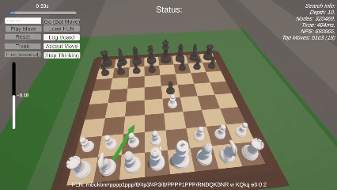

# Minimax Chess Engine + Unity Game

A chess engine written from scratch in C#, searching about 1.4 million positions per second and playing at roughly 2000 Elo (estimated against Stockfish), with a 3D Unity game built on top.

<!--  -->

## Engine (C#)
- **Search:** iterative-deepening negamax with alpha-beta pruning, reaching depth 11 from the opening position in under 3 seconds
- **Speed:** about 1.4M positions per second on one CPU core
- **Evaluation:** tapered (midgame/endgame) material and PeSTO-style piece-square tables, mobility, bishop pair, rook on open files, tempo
- **Search features:** quiescence search, transposition table with Zobrist hashing, MVV-LVA capture ordering, killer moves, history heuristic, late move reductions, multi-PV top moves
- **Exploitative modes:** an asymmetric search that reads its own moves deeply and the opponent's replies shallowly to set traps, plus skill-adaptive move selection among near-best moves
- **Interfaces:** UCI (works in Arena, CuteChess, En Croissant) and a text CLI

The engine source lives in the Unity project (`unity/Assets/Scripts/ChessBot/`); `engine/` builds the same files as a console app.

## Game (`unity/`, Unity + C#)
- 3D board with arrows drawn at runtime for the engine's top candidate moves
- Live evaluation bar and search info (depth, nodes, time, nodes per second)
- Load positions from FEN, play moves, and let the bot think for a set time (slider) or analyze continuously
- Move modes: best move, exploitative, skill-adaptive, and trap-seeking

## Background
I built this after my [AlphaZero-style chess bot](https://github.com/colinHuang314/AlphaZero-Chess) couldn't beat me, inspired by Sebastian Lague's *Coding Adventure: Making a Better Chess Bot*. It was built with AI-assisted development (Claude); I chose which techniques to implement from chess-programming resources, starting with iterative deepening, and estimated its strength in games against Stockfish.

## Running it
Engine (requires the .NET 8 SDK):

```bash
cd engine
dotnet run -c Release            # UCI mode, for any UCI chess GUI
dotnet run -c Release -- cli     # text CLI: type moves like e2e4, or "go"
```

Game: open `unity/` in Unity 6000.3.12f1, import the "Chess Set" package by Gentlemen Gaming (3D piece models, not included in this repo) into `Assets/Chess Set/`, and open `Assets/Scenes/SampleScene`.
